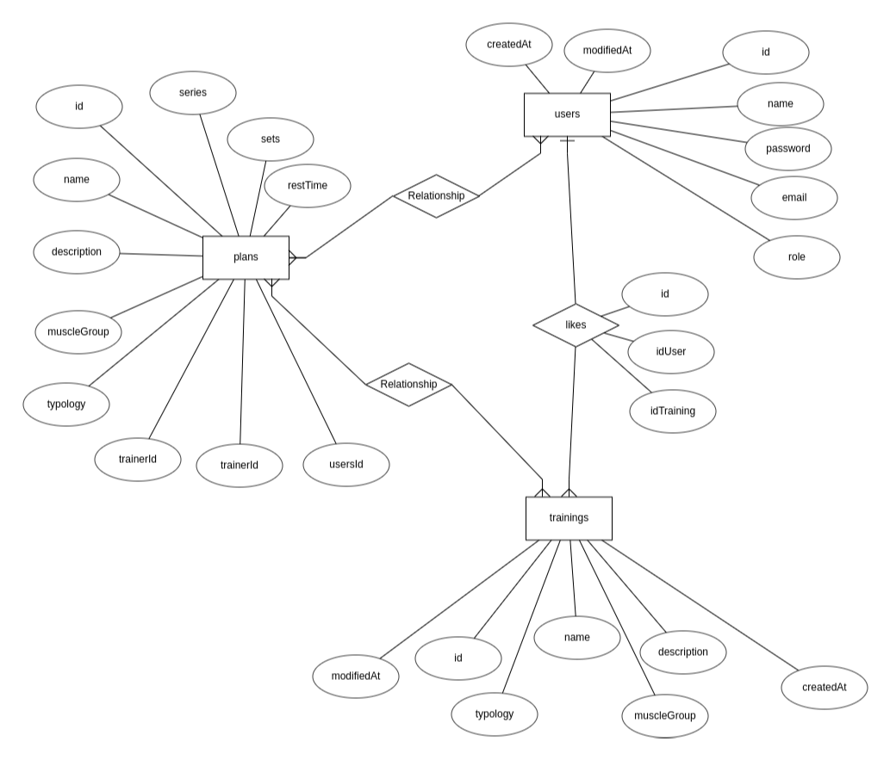

# TrainningAppBack  💪

 

## ABOUT ✍️
###  Description
Implement and API that allow to manage (publish, modify, delete, vote and filter) trainings on a gym.

### Characteristics
- **Trainer role**
    - Is the only one that can add, delete and modify trainings.
- **Registered role**
    - Log in
    - They can get a list of trainings, see the info of an training and vote them.
- **Unregistered role**
    - Log in
    - Register
    - They only can log in and register

---
 

## OUR DATABASE 📝

###  Entities of data base

- **USERS** - Can be admin type, trainer type or user type
    - id
    - name
    - email
    - password
    - role
    - createdAt
    - modifiedAt

- **TRAININGS** - Contains information about the trainings.
    - id
    - userId
    - name
    - description
    - picture
    - typology
    - muscle group
    - votes
    - createdAt
    - modifiedAt

- **PLANS** - Contains information about the plans.
    - id
    - name
    - description
    - typology
    - muscle group
    - series
    - sets
    - restTime
    - trainingId
    - trainerId
    - userId
    - createdAt
    - modifiedAt

### Entities Relationship

- **LIKES** - Contains the likesthe users give to an training
    - id
    - idUser
    - idTraining
---
 

## ENDPOINTS ▶️

### Endpoints of users (trainer)

-  **POST** > [/trainings/:idTraining/add] - Add training. [ _**With trainer token**_ ]
-  **GET** > [/trainings/:idTraining] - Add training. [ _**With trainer token**_ ]
- **PUT** > [/trainings/:idTraining/modify] - Modify training [ _**With trainer token**_ ]
- **DELETE** > [/trainings/:idTraining/delete] - Delete training [ _**With trainer token**_ ]

### Endpoints of users

- **GET** > [/trainings/] - Show trainings list. [ _**With token**_ ]
- **GET** > [/trainings/:idTraining] - Show a training information. [ _**With token**_ ]
- **GET** > [/trainings?category=typology] - Filter trainings by typology. [ _**With token**_ ]

### Endpoints of users (anonymous)

-  **POST** > [/login/] - Log in.
-  **POST** > [/register/] - Regist er.
---
 

## OUR DEPENDENCIES 🦮
- bcrypt
- dotenv
- express
- express-fileupload
- jsonwebtoken
- mysql2
- sharp
- nanoid
